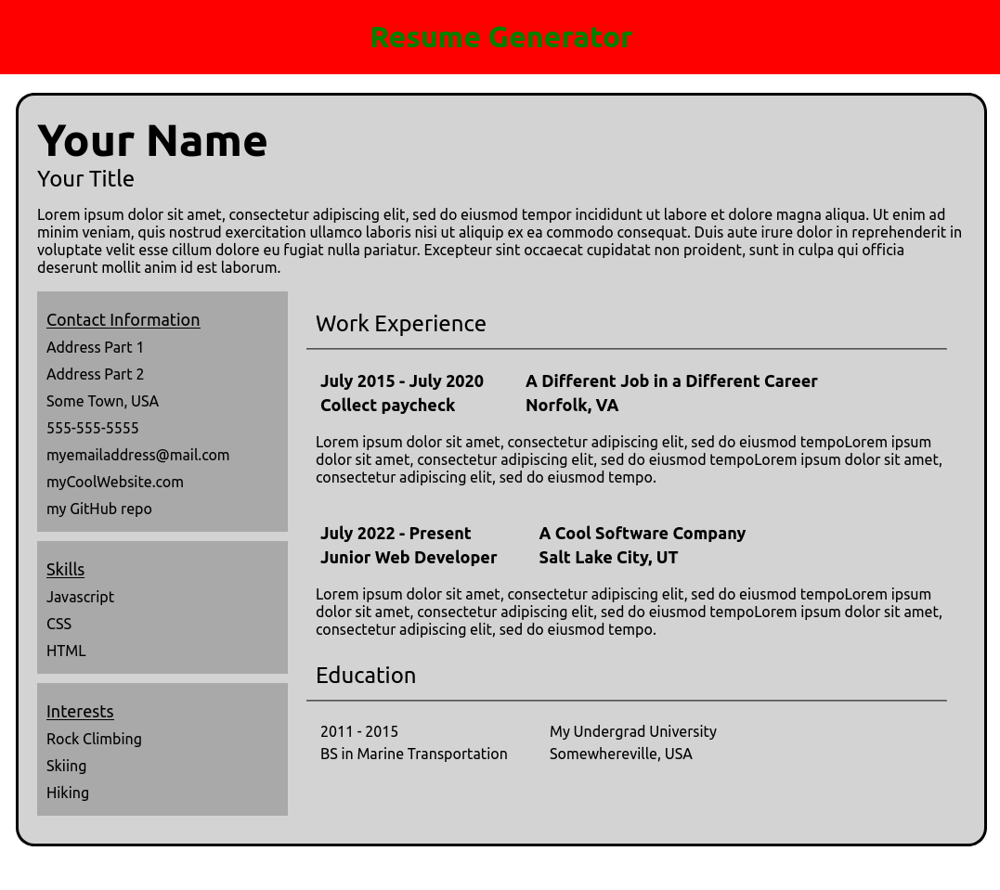

## CV Generator

View the project live [here](https://brenton-j-andrews.github.io/cv-project/).

---

#### About this project

Completed for [The Odin Project](https://www.theodinproject.com/lessons/node-path-javascript-cv-application) JavaScript course.

A simple resume generator that was my first project using React. This project served as an introduction to React class based components. I am plenty familiar with classes from my time learning Java and Python, but there were some unique aspects to React that made this project worthwhile. The resume generator contains 6 fields that can be modified. 

To close a form, re-press the 'add' button that you opened the form with. I should have made that clearer. 

It appears that I was optimistic with the idea of having a job by July, hopefully only off by a couple months!

---

### Frameworks

This project was built using React.

---

### Takeaways

This project taught me a good amount about some of the nuances of React compared to plain old JavaScript and the importance of planning a project out thoroughly before digging in (see bullet 1 below).

---

### Improvements

- Take all repeated Component class methods and package them into one subclass that Resume Components can be extended from. This will reduce repeating quite a bit!
- Add a PDF generator.
- Fix the form positioning for the left boxes.
- Change the resume display sizing for larger / wider monitors.
- Learn more about React key requirements for arrays and implement my array.map section properly (though it does work now...).
